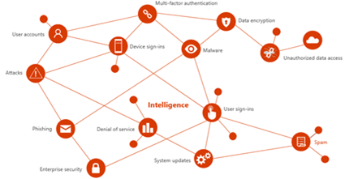

# Test file for image positioning

The Microsoft Threat Intelligence Center (MSTIC) team—one of the main producers of threat intelligence at Microsoft—collects the threat intelligence that’s infused into products and services. MSTIC aggregates data from sources such as:

First-party threat intelligence feeds (honeypots, malicious IP addresses, botnets, malware detonation feeds)
Third-party sources (threat intelligence feeds, reference/lookup data)
Analysts/human-based observation and intelligence collection

 
